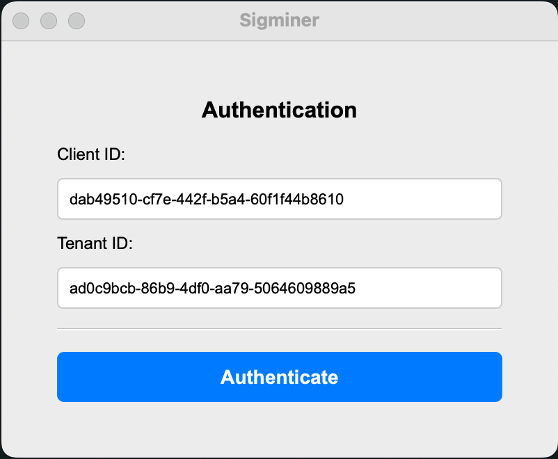
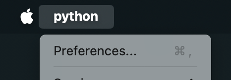
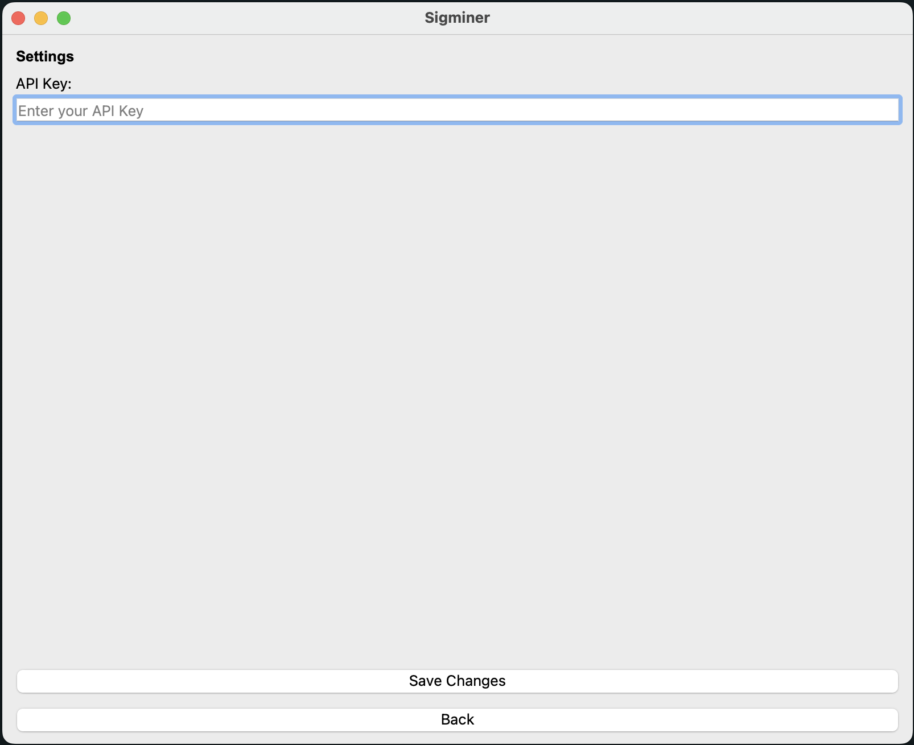
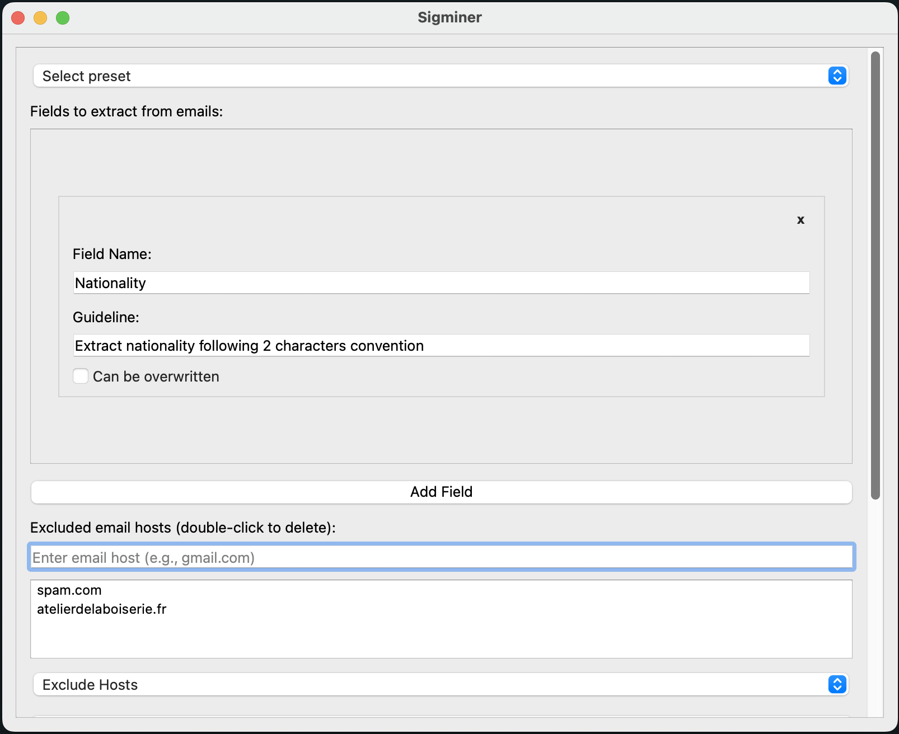
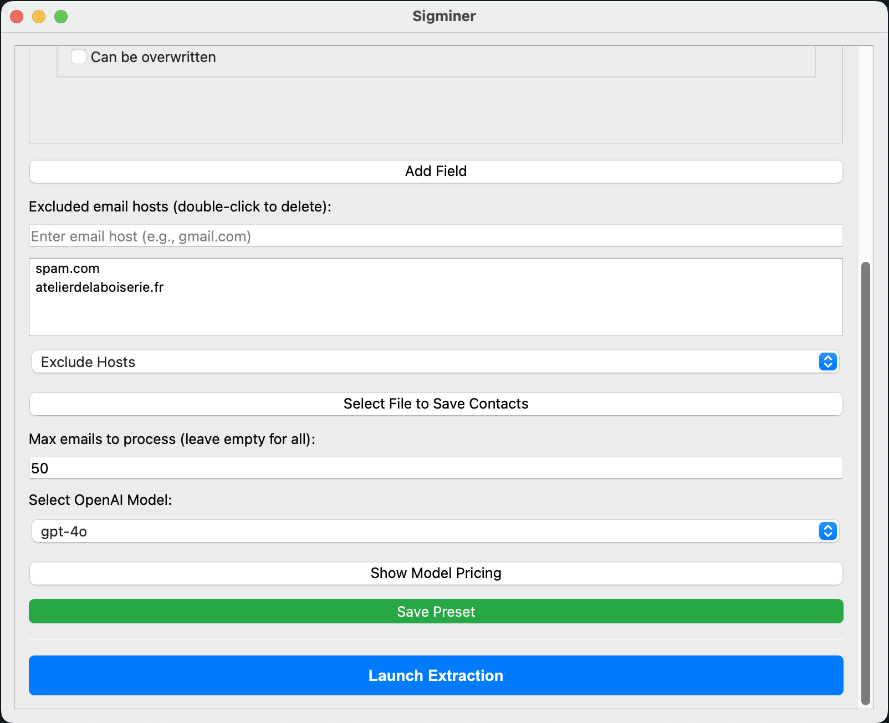
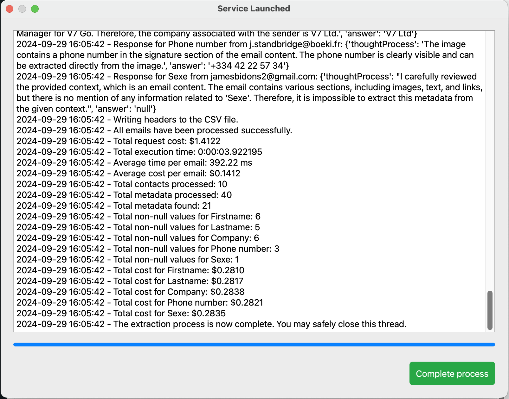

# SigMiner - Email Extraction and Metadata Analysis Tool

SigMiner is a desktop application designed to extract metadata from emails using LLM models. The application allows users to configure fields for extraction, specify email hosts to include or exclude, and save the extracted data in CSV format. It also features an easy-to-use UI for authentication, settings management, and launching extraction tasks.

## Features

-   **Email Metadata Extraction**: Configure fields to extract from emails, such as names, companies, or other metadata.
-   **OpenAI Model Integration**: Use GPT models to analyze and extract metadata from emails.
-   **Email Host Filtering**: Specify email hosts to include or exclude during processing.
-   **Preset Management**: Save and load configurations (presets) for reuse.
-   **Progress Tracking**: Real-time progress tracking with logs and a progress bar during extraction.
-   **Settings Management**: Manage API keys, authentication credentials, and other settings through the app.
-   **CSV Export**: Export extracted email data into a CSV file with customizable fields.

## Images

### Auth

This image shows the authentication screen where users can enter their credentials to log in.

### Click Preferences

This image demonstrates how to access the preferences menu to configure various settings.

### API Key

This image illustrates the screen where users can input their OpenAI API key for metadata extraction.

### Config 1

This image displays the first part of the configuration settings, where users can set up extraction fields and other parameters.

### Config 2

This image shows the second part of the configuration settings, including options for email host filtering and preset management.

### Process End

This image captures the end of the extraction process, showing the final status and any relevant logs or messages.

## Installation

### Prerequisites

-   Python 3.11 or above
-   PyQt5 for the graphical interface
-   Poetry for dependency management

### Install Dependencies

1.  Clone the repository:
    
    ```git clone https://github.com/your-repo/sigminer.git
    cd sigminer
    ```
    
2.  Install dependencies using Poetry:
    
    ```
    poetry install
    ```
    
3.  Activate the virtual environment:
    
    ```
    poetry shell
    ```
    
4.  Ensure you have an API key from OpenAI for metadata extraction.
    

## Building the Application

To build the application into a standalone executable, you can use PyInstaller with Poetry. Follow these steps:

1. Ensure you have all dependencies installed and the virtual environment activated:
    ```
    poetry install
    poetry shell
    ```

2. Run the following command to build the application:
    ```
    poetry run pyinstaller --onedir --windowed --hidden-import=tiktoken_ext.openai_public --hidden-import=tiktoken_ext --collect-all litellm --copy-metadata litellm sigminer/app.py
    ```

### Explanation of Arguments

- `poetry run pyinstaller`: This runs PyInstaller within the Poetry-managed virtual environment.
- `--onedir`: Creates a one-folder bundle containing the executable and all dependencies.
- `--windowed`: Builds a windowed application (no console window).
- `--hidden-import=tiktoken_ext.openai_public`: Ensures that the `tiktoken_ext.openai_public` module is included in the build, even if it is not explicitly imported in the code.
- `--hidden-import=tiktoken_ext`: Ensures that the `tiktoken_ext` module is included in the build.
- `--collect-all litellm`: Collects all files related to the `litellm` package, including data files and dependencies.
- `--copy-metadata litellm`: Copies the metadata for the `litellm` package, which may be required for the package to function correctly.
- `sigminer/app.py`: The entry point of the application to be bundled.

After running the command, the built application will be located in the `dist` directory within a subdirectory named after your project.


## Usage

### Running the Application

To launch the application, run the following command:


```
python sigminer/app.py
```

The application will start and open the main window.

### Authentication

1.  The first screen you'll encounter is the **Authentication** view. Enter your **Client ID** and **Tenant ID** (provided by Azure) to authenticate the application.
2.  Upon successful authentication, the email extraction view will be enabled, and you can proceed with configuring the metadata extraction process.

### Settings

-   The **Settings** menu is accessible from the main window. Use it to set the **API Key** required for the OpenAI integration.
-   The **API Key** is stored securely and used during email metadata extraction tasks.

### Email Metadata Extraction

1.  **Configure Fields**: In the **Email View**, you can configure fields to extract metadata from emails. For each field:
    
    -   Specify the **Field Name** (e.g., "Name", "Company").
    -   Provide a **Guideline** for how the field should be extracted.
    -   Indicate whether the field **Can Be Overwritten** if it exists but is empty or incomplete.
2.  **File Selection**: Use the **Select File to Save Contacts** button to choose a CSV file where the extracted data will be saved.
    
3.  **Email Host Filters**: You can specify email hosts (e.g., `gmail.com`) to include or exclude during extraction. Use the **Include/Exclude Hosts** toggle to change modes.
    
4.  **Model Selection**: Select the OpenAI model to use for extraction from the dropdown menu. You can also view the model pricing by clicking **Show Model Pricing**.
    
5.  **Launch Extraction**: Once everything is configured, click **Launch Extraction** to begin the metadata extraction process. The app will display real-time progress and log messages during the process.
    

### Preset Management

-   **Save Preset**: After configuring fields, email hosts, and other options, you can save the configuration as a **Preset** for future use. This can be done by clicking **Save Preset** and providing a name.
-   **Load Preset**: You can load previously saved presets by selecting them from the dropdown list in the **Email View**.
-   **Delete Preset**: Presets can be deleted by selecting the preset and clicking the **Delete Preset** button.

## Logs and Progress

-   The **Progress Bar** shows real-time progress of the metadata extraction process.
-   The **Log Output** area displays logs detailing each step of the process, including any errors, successful extractions, and time/cost statistics.

## CSV Export

After the extraction process completes, the extracted data will be saved in the specified CSV file. Each row represents an email with metadata in different columns. The first line of the CSV will contain the headers (field names).

## Development

### Code Structure

-   `sigminer/app.py`: The main entry point for launching the app.
-   `sigminer/ui/`: Contains all UI components (authentication, settings, email extraction view, etc.).
-   `sigminer/core/`: The core logic for email management, extraction worker, and LLM (Large Language Model) interaction.
-   `sigminer/config/`: Configuration management, including API key storage and presets.

### Running Tests

You can add tests for your application and run them using:


```
poetry run pytest
```

## License

This project is licensed under the MIT License. See the `LICENSE` file for details.


